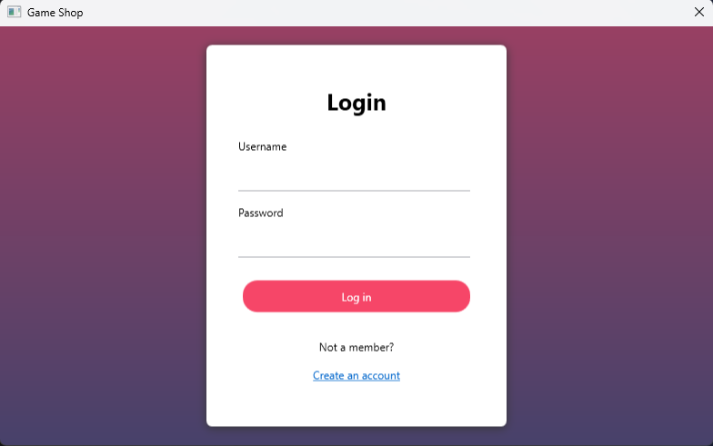
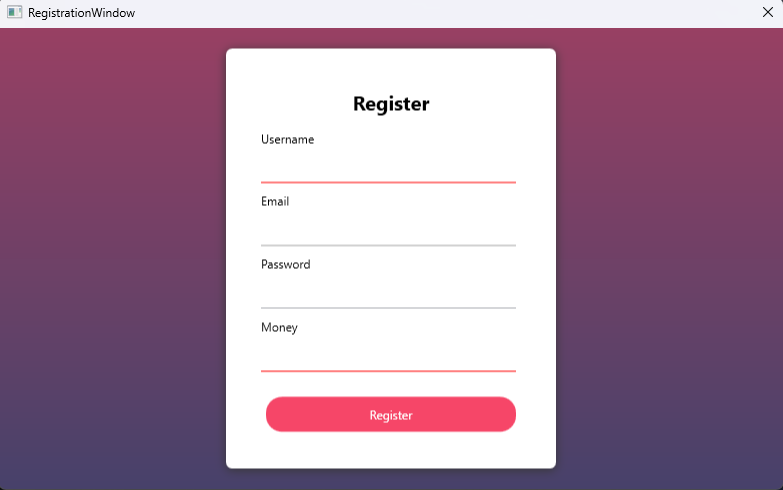
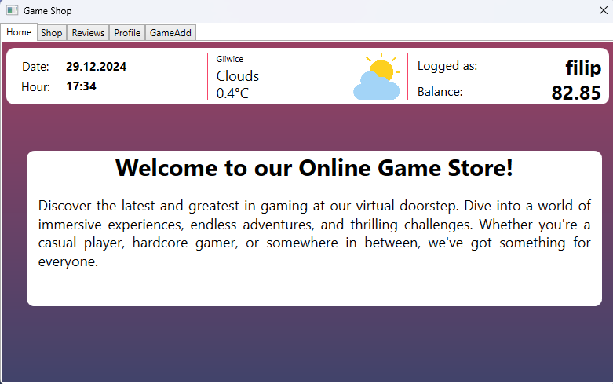
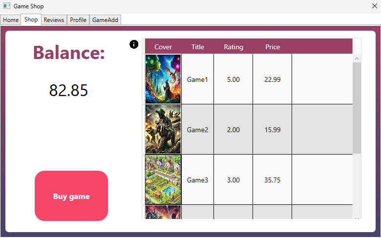
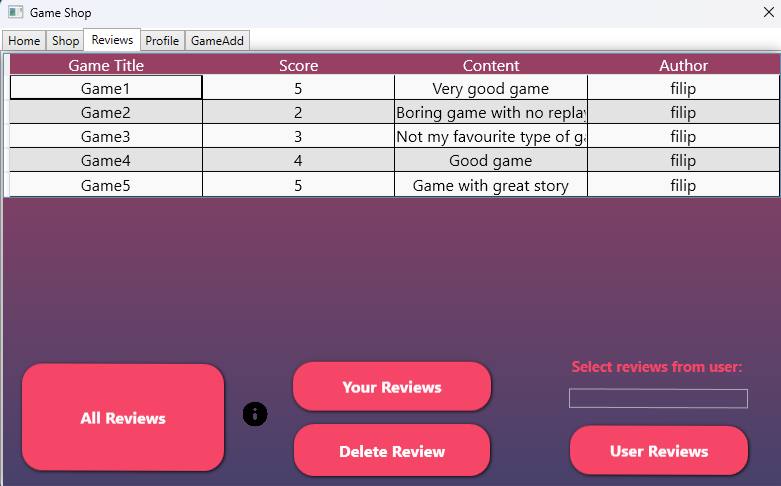
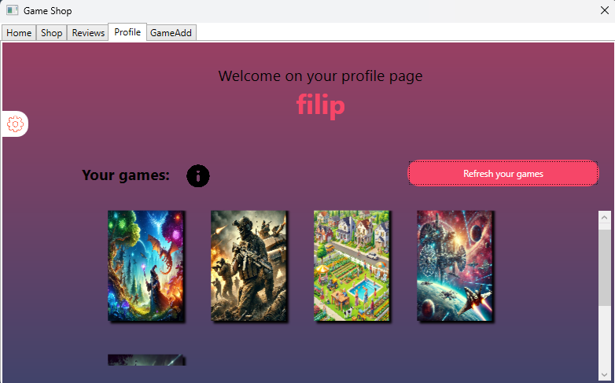
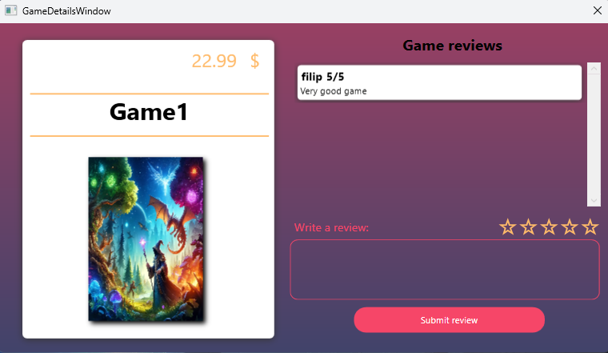
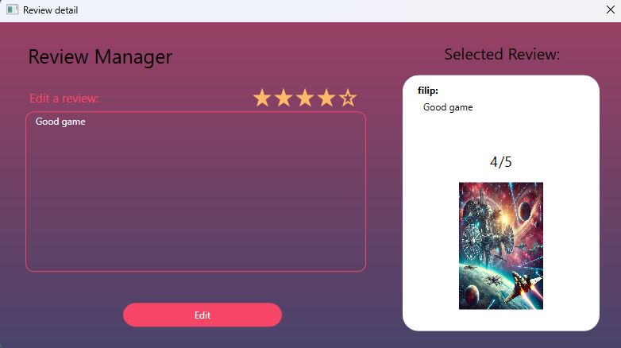
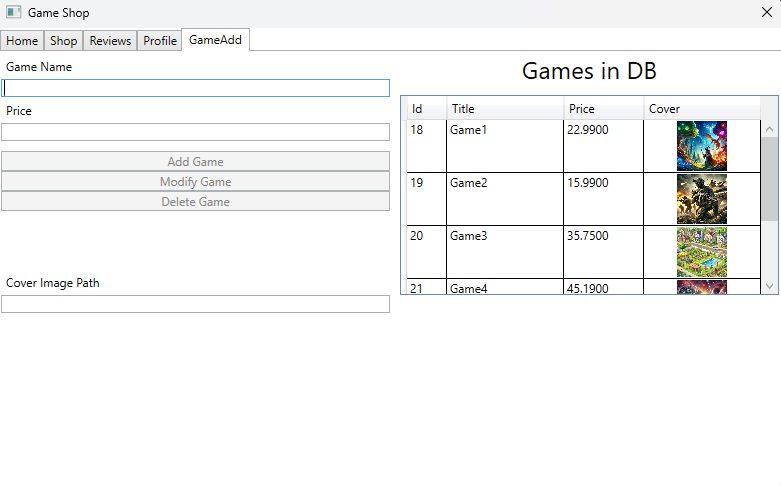

# Game Store Application

## Introduction
Game Store is a Windows Presentation Foundation (WPF) application built using .NET and C#. The application connects to a SQL database to store and manage information about games, users, and reviews. It employs the Entity Framework for database interactions and follows the MVVM (Model-View-ViewModel) architectural pattern. Additionally, one of the screens integrates an external API to display weather and location information. The project makes use of triggers in the views for enhanced user interface interactivity.

## Authors
- [DarknessoPirate](https://github.com/DarknessoPirate)
- [filip-wojc](https://github.com/filip-wojc)

## Features
1. **User Registration and Login** - Secure registration and login system with password hashing for data protection.
2. **Game Management** - Admin-only features for adding, modifying, and deleting games in the database.
3. **Game Purchase and Profile Management** - Allows users to purchase games and view them on their profile page.
4. **Review Management** - Users can add, edit, and delete their own reviews.
5. **Game Details and Reviews Display** - Displays detailed information about each game along with all user reviews.
6. **User Review Search** - View all reviews by a specific user or filter your own reviews by username.

## Technologies Used
- **C# .NET** - Core programming language and framework.
- **WPF (Windows Presentation Foundation)** - For building the application’s user interface.
- **SQL Database** - To store data related to games, users, and reviews.
- **Entity Framework** - For database connectivity and ORM (Object-Relational Mapping).
- **External API Integration** - Fetching weather and location information.
- **MVVM Design Pattern** - Ensures separation of concerns and easier maintainability.
- **Triggers in Views** - For dynamic UI behavior.

## Application Demo
_Screenshots of the application can be found below:_
#1. User registration and login page

2. Home screen

3. Shop screen with games list

4. Reviews screen

5. Profil page

6. Game details screen

7. Review detail screen

8. Admin screen for managing games in database

## Future Development Plan
1. **Wishlist Feature** - Enable users to create and manage wishlists.
2. **Enhanced Filtering and Sorting** - Provide advanced filtering options for games and reviews.
3. **Email Notifications** - Notify users about new game in store.
4. **Improved Review Features** - Add upvoting and downvoting for reviews.

### License
This project is available for use under the MIT License.

